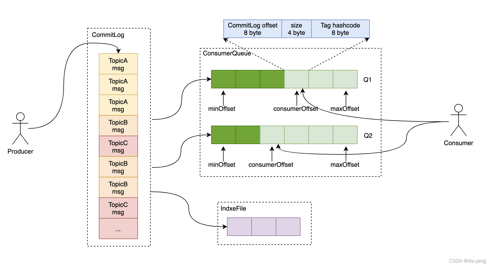

# **1) 三个文件各干什么**

- **CommitLog（物理日志）**

  集群中**每个 Broker**只有一份**顺序追加**的大文件队列（按 1GB 切段，mmap）。**所有 Topic/Queue 的消息都先写到这里**。这里的偏移量叫 **physical offset**（commitlog offset）。

- **ConsumeQueue（逻辑队列索引）**

  对于 **每个 Topic 的每个 QueueId**，Broker 维护一条“轻量索引文件流”（同样切段）。**每条索引固定 20B**：

  8B commitlogOffset + 4B size + 8B tagHashCode

  它把“某个队列里的第 N 条消息”映射到 **CommitLog 的物理位置**，并顺带存一份 **Tag 的哈希** 方便服务端过滤。

- **IndexFile（按 key 查询）**

  基于哈希槽的倒排索引：keyHash -> (commitlogOffset, timeDiff, nextIndex) 链表，用于 **按 Message Key 或按时间范围**做快速定位（不是消费路径必需，更多用于查询/运维）。

> 直观理解：**CommitLog 存“内容本体”，ConsumeQueue 存“目录（每条 20B 的目录项）”，IndexFile 存“关键字检索表”。**


# **2) 写入路径（Producer → Broker）**

1. Producer 把消息发到 Broker；Broker **先顺序写 CommitLog**（几乎就是 append 到 mmap）。
2. Broker 的 **ReputMessageService** 持续从 CommitLog 读取新追加的消息，**派发**给两个“构建器”：
   - BuildConsumeQueue：按消息头里的 (topic, queueId, queueOffset) 把**目录项**写入该队列的 **ConsumeQueue**；
   - BuildIndex：若消息设置了 keys，则把 keyHash -> commitlogOffset 写入 **IndexFile**。
3. 只要 CommitLog 落盘成功，这两个索引**最终都会补齐**；Broker 宕机恢复会从最后校验点继续重放构建。

> 这里的关键：**写入只随机 1 次（CommitLog 顺写），构建索引是顺序小写**，整体非常扛吞吐。


# **3) 读取路径（Consumer → Broker）**

1. Consumer 拉取时带上 (topic, queueId, beginOffset, maxMsgNums, tag 过滤条件 …)。
2. Broker 先在 **ConsumeQueue** 里按 beginOffset 找到那一段**目录项**（每条 20B，连续内存非常友好）。
3. 取出目录项里的 commitlogOffset/size/tagHashCode：
   - 若有 **Tag 过滤**，先在 **ConsumeQueue 侧**用 tagHashCode 做**粗过滤**（有少量假阳性可能，客户端还会精过滤）；
   - 通过 commitlogOffset/size 去 **CommitLog** 把**消息体**读出来，返回给客户端。
4. 响应里会带 minOffset / maxOffset / nextBeginOffset（图中三个指针），方便客户端推进或纠偏。


# **4) 这三个 offset 是什么**

- **minOffset**：该 **ConsumeQueue** 当前仍然保留的**最小逻辑位点**（更早的已随老文件删除）。
- **maxOffset**：该队列**下一条将要写入**的逻辑位点（不含本身）。
- **consumerOffset**：**某个消费组**在这个队列上的已处理进度（保存在 Broker 的 ConsumerOffsetManager 中）。

> 注意：**CommitLog 的 offset 是“物理偏移”**；**ConsumeQueue 的 offset 是“队列内第几条（逻辑序号）”**，两者不一样。ConsumeQueue 的每条目录项里正是**把逻辑序号映射到物理偏移**。


# **5) 文件尺寸与内存映射（常见默认）**

- **CommitLog**：单段默认 1GiB；顺序写 + MappedByteBuffer。
- **ConsumeQueue**：目录项 20B/条；**单段默认 30,000,000B** ≈ 可容纳 **1,500,000 条**目录项；同样 mmap，二分 + 顺扫极快。
- **IndexFile**：固定大小的大文件（头 + hash 槽 + index 条目），默认可容纳数百万级条目；主要用于工具化查询，不走主消费链路。


# **6) 删除与保留（为什么不会“引用断裂”）**

- CommitLog 的旧段删除有两个门槛：

  1. **时间/磁盘水位策略**到期；

  2. **不得早于任何 ConsumeQueue 仍在引用的最小** **commitlogOffset**。

     Broker 会先看所有 ConsumeQueue 的最小物理引用，只有 **完全“无人引用”的 CommitLog 段**才会被删除。

- ConsumeQueue 的旧段按时间直接删；删后对应的 **minOffset** 就会前移。

- IndexFile 过期与 CommitLog 同步回收（超过时间/个数会滚动并删除旧的）。


# **7) 为什么要这么设计（对比 Kafka）**

- **Kafka**：每个 partition 自己是一条“物理日志”；

- **RocketMQ**：**全 broker 共享一条 CommitLog**，各队列用 **ConsumeQueue 当“目录”**。

  - 好处：**写放大小**（所有写都聚合到一个 append 点）、**顺序写最大化**、便于**服务端按 Tag 过滤**（ConsumeQueue 里有 tagHashCode）。
  - 代价：多了一步“构建索引”的后台流程（但它是顺序小写，成本低）；恢复时要根据 CommitLog 重建 ConsumeQueue/Index 的尾部。

  


# **8) Tag 过滤与假阳性**

- tagHashCode 是 Tag 的 64bit 哈希，**用来在 Broker 侧做第一次粗过滤**，减少把无关消息从 CommitLog 读出的次数；
- 因为是哈希，**存在极低概率碰撞** ⇒ 可能把少数“不匹配”的消息也返回给客户端；**客户端还会再按真正的 Tag 精过滤**，保证语义正确。


# **9) 消费进度与重试**

- consumerOffset 是**消费组级**的逻辑位点，成功处理后才推进；失败返回 RECONSUME_LATER 会触发**重投**（可能换到延迟队列/重试队列），这与存储结构解耦。
- 进入 **DLQ**（死信队列）后，就是另一个 Topic/Queue，依然走同一套存储（CommitLog+ConsumeQueue）。


# **10) 常见坑与排查点**

- **“拉不到最新消息”**：多数是 **ReputMessageService 落后**（ConsumeQueue 尚未构建到最新），或客户端 beginOffset 超前；看 Broker 的“dispatch/构建延迟”与响应里的 nextBeginOffset。
- **“非法 offset”**：客户端本地位点早于 minOffset（文件已删），要用 minOffset 重置。
- **“查询 Key 很慢/查不到”**：IndexFile 只包含设置了 keys 的消息；命中不到就只能全量扫描。
- **Tag 过滤无效/漏匹配**：确认订阅表达式与服务端过滤类型（TAG/SQL92）；记住服务端是**哈希粗过滤 + 客户端精过滤**。


## **一句话收束**

这张图表达的是：**消息先顺序写到 CommitLog；随后用 ConsumeQueue 把“队列内第几条”映射到“物理偏移”（每条 20B，还带 Tag 哈希便于服务端过滤）；按 Key/时间查询走 IndexFile**。消费时先扫 **ConsumeQueue（快）** 再去 **CommitLog（读正文）**；min/consumer/max 三个 offset 分别是“可读最小/本组进度/当前最大”。这套结构让 RocketMQ 同时兼顾了**极致顺序写**与**灵活的服务端过滤/查询**。


# mmap

mmap（memory-map）就是把**文件的一段内容直接映射到进程的虚拟内存地址空间**。

映射后，这段文件看起来就像一块普通内存：你对这块地址做读写=对文件做读写（由内核在背后完成磁盘-内存的换入/回写）。

```
进程虚拟内存
+-------------------+        发生缺页(page fault)时
| [mmap 映射区域]   |  <----  内核把对应文件页装入页缓存(page cache)，
+-------------------+        建立页表映射；写入则标记为“脏页”，
                             之后由内核或显式 msync/force() 回写到磁盘
```

- **映射**：mmap(fd, length, PROT_*, MAP_SHARED|MAP_PRIVATE, offset)
  - MAP_SHARED：对映射内存的写，**其他进程可见**，并最终**回写文件**。
  - MAP_PRIVATE：写时复制（COW），**不改原文件**，只改自己的私有副本。
- **按需装载**：首次访问某页触发**缺页中断**，内核把文件对应页装进**页缓存**并建立页表；读写就像普通内存。
- **落盘**：脏页会被后台写回线程刷新；你也可调用 **msync()（Java 用 MappedByteBuffer.force()）**强制把当前脏页刷到磁盘。
- **页对齐**：offset 必须是页大小（通常 4KB）的倍数，length 会向上取整。

## **为什么快？**

- **少一次拷贝**：普通 read() 要把内核页缓存再拷到用户缓冲区；mmap 直接让你的指针指向页缓存，省掉这一步（仍然要从磁盘→页缓存）。
- **顺序/随机都友好**：索引类小结构直接按数组下标读写；内核会做预读/回写合并。
- **跨进程共享**：多个进程映射同一文件页，共享同一份页缓存。


# IndexFile

“倒排索引”（Inverted Index）这 4 个字在 RocketMQ 的  里，意思是：

**按“Key → 消息位置（commitlog 物理偏移）”建立一张反向查表**。

正常写入顺序是“时间→CommitLog”，而倒排是“关键字→这批消息在 CommitLog 里的位置列表”。有了它，你就能用 **Message Key + 时间范围** 快速把消息找出来（运维查询/补偿常用），不走消费路径。

下面把 **IndexFile 的结构、写入、查询、复杂度与边界**讲清楚。


## **1) 文件结构（mmap，定长）**

```
+----------------------------+
| IndexHeader (40B)          |  记录该文件覆盖的时间/物理范围与计数
|  - beginTimestamp  (8B)
|  - endTimestamp    (8B)
|  - beginPhyOffset  (8B)
|  - endPhyOffset    (8B)
|  - hashSlotCount   (4B)
|  - indexCount      (4B)
+----------------------------+
| HashSlotTable (hashSlotCount * 4B)
|  - 每个槽存“最新一条索引项的编号”（单向链表头）
+----------------------------+
| IndexItems (indexCount * 20B)
|  - 每条 20B： [keyHash 4B]
|                 [phyOffset 8B]
|                 [timeDiff 4B]
|                 [prevIndex 4B]  → 指向同槽上一条项（形成反向链）
+----------------------------+
```

- **Hash 槽**：slot = abs(keyHash) % hashSlotCount；每个槽里放**该槽最近写入**的索引项编号。
- **索引项 20B**：
  - keyHash：Key 的 32 位哈希（消息体里真实 key 仍保留，用于最终校验）；
  - phyOffset：这条消息在 **CommitLog** 里的物理偏移；
  - timeDiff：storeTimestamp - beginTimestamp 的秒级差（省空间）；
  - prevIndex：**同一槽**里上一条项的编号，形成**单链表（后写在前）**。
- 一个 IndexFile 容量固定：**hash 槽个数 + 最大索引条数**可配置（StoreConfig：maxHashSlotNum、maxIndexNum），写满或跨越较长时间后**滚动新文件**。

> 这就是“倒排”：从 **Key → 槽 → 链表 → 一串 commitlog 偏移**，而不是按时间顺序去扫 CommitLog。


## **2) 写入流程（构建索引）**

1. Producer 发来的消息先顺序写 **CommitLog**。
2. 后台 **ReputMessageService** 读到新消息；若消息设置了 keys（可有多个，空格分隔），则对每个 key：
   - 计算 keyHash，求 slot；
   - 写一条 **IndexItem**（20B），把 prevIndex 设为 **该槽原来的值**；
   - 把 **该槽的值更新**为“当前这条项的编号”；
   - 更新 Header 的 indexCount/endTimestamp/endPhyOffset。
3. Broker 崩溃恢复时会从校验点**重放**尾部，确保索引与 CommitLog 对齐。

**写入特点**：一次顺序大写（CommitLog）+ 少量顺序小写（IndexFile），IO 友好；**和消费路径解耦**，索引慢一点不会影响拉取。


## **3) 查询流程（Key + 时间范围）**

给定 (topic, key, beginTime, endTime, maxNum)：

```
slot = abs(hash(key)) % hashSlotCount
i = readSlot(slot)           // 取到链表头（最近项）
while (i != INVALID && 还没够 maxNum) {
  item = readIndexItem(i)
  if (item.keyHash == hash(key) 
      && item.time 在 [beginTime, endTime]) {
        结果列表.add(item.phyOffset)
  }
  if (item.time < beginTime) break;   // 再往前基本更老，可提前收敛
  i = item.prevIndex                  // 沿链表往“更早”走
}
→ 用得到的 commitlogOffsets 去 CommitLog 拉出消息体，再用真正的 key/属性做“精确校验”（消除哈希碰撞）
```

- **返回的是物理偏移列表**；真正的消息正文仍然从 **CommitLog** 读。
- 因为只存了 hash，**存在极低概率的哈希碰撞**，所以读出正文后会再用消息中的真实 keys 做二次匹配。
- 结果数量受 maxNum 限制，避免沿链表“跑太深”。


## **4) 为什么要用“链表 + 倒排”**

- **空间常数小**：每条 20B；一个文件能放**百万级**索引项。
- **追加友好**：新到消息只需“在槽头前插入一项”，是顺序小写；
- **时间维度快速剪枝**：timeDiff 让你在遍历中快速**早停**（超出时间下界直接 break）。
- **典型用途**：运维/补偿按 OrderId、TraceId、UserId 查消息；配合时间窗精准定位。


## **5) 复杂度与限制**

- **单 Key 查询复杂度** ≈ **O(链长)**；如果某槽下碰撞严重或该 Key 写得非常密集，链会长，查询会慢。
- **不是消费路径**：正常拉取消息不依赖 IndexFile（走 ConsumeQueue → CommitLog），所以**索引退化不影响消费**。
- **只索引设置了** **keys** **的消息**；没设置就查不到（只能全量扫描 CommitLog）。
- **时间精度**：timeDiff 以秒存储，边界处可能±1s 的容忍，实际还有 Header 的 begin/endTimestamp 帮助范围判断。
- **文件生命周期**：IndexFile 随时间滚动；当对应的 CommitLog 段被回收后，旧的 IndexFile 也会一起被删（确保不会索引到已回收的物理偏移）。


## **6) 和 ConsumeQueue 的区别（别混淆）**

- **ConsumeQueue**：**按 Topic-Queue 的“逻辑顺序”** → 20B 目录项映射到 **物理偏移**，用于**消费拉取**与**Tag 粗过滤**。
- **IndexFile（倒排）**：**按 Key 的“内容检索”** → 从 key 直达一串 **物理偏移**，用于**查询/排障/补偿**，**不参与正常消费**。


## **7) 什么时候值得开 & 怎么用**

- 你需要**按业务主键**查消息（订单号、流水号、traceId…）。
- 生产端务必 **设置 message keys**（可多个），例如：

```
Message msg = new Message("TopicA", body);
msg.setKeys("order_123 trace_abc"); // 用空格分隔多个 key
```

- 查询走 MessageStore#queryMessage(topic, key, maxNum, begin, end)（Admin/工具侧常用）。


**一句话总结**：

**IndexFile 的“倒排索引”就是：Key → （哈希槽）→（链表上的多条 20B 索引项）→ CommitLog 物理偏移**。

它让你在不打扰消费路径的前提下，用 Key + 时间窗快速定位消息；真正读正文仍靠 CommitLog，并在客户端做一次精匹配来规避哈希碰撞。